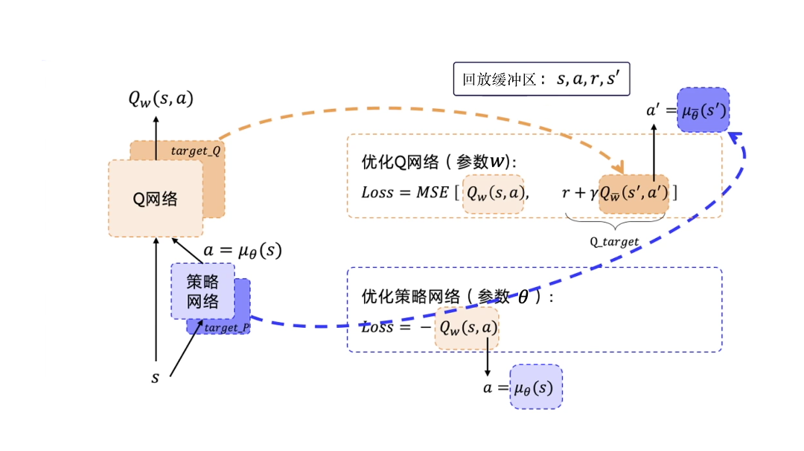
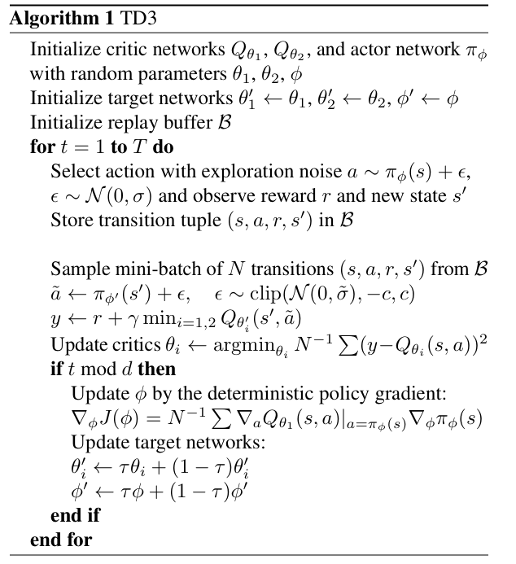
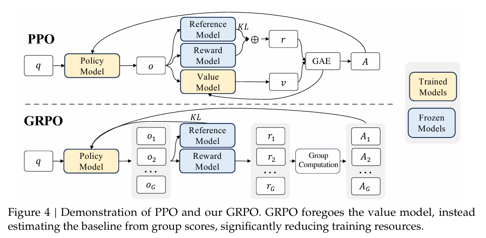
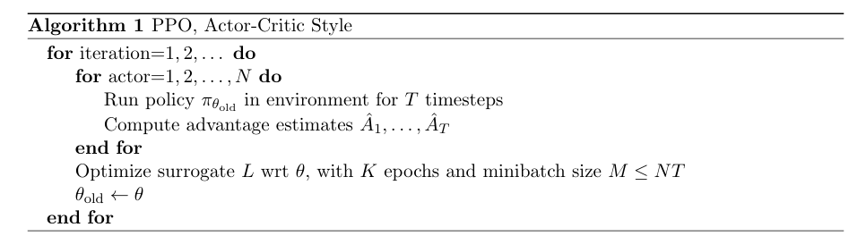

# EasyRL
First of all, I would like to thank [EasyRL](https://datawhalechina.github.io/easy-rl/#/) for providing a great platform for learning reinforcement learning (RL) algorithms. This repository is inspired by the EasyRL project and aims to provide a collection of RL algorithms implemented in Python using Pytorch.

This repository contains the following settings in the `gym` module:
- Cliffwalking
- Cartpole
- Pendulum

I will list my experiences in implementing RL algorithms in this repository. The main purpose of this repository is to keep records of the details and tricks used in the implementation for better understanding and future review.

## Project1: Cliffwalking

### Implementation Details
- Algorithm: Q-Learning
- State Space: Discrete
- Action Space: Discrete
- Reward Structure: Sparse

### Tricks and Tips
1. **Exploration vs Exploitation**: Use epsilon-greedy strategy for balancing exploration and exploitation.
2. **Experience Replay**: Store and sample past experiences to break correlation between consecutive samples.
3. **Algorithm**: Maintain a Q-table to store state-action values. After each experience, update the Q-value by lr * td_error, where td_error = reward + gamma * max(Q(s', a')) - Q(s, a).

## Project2: Cartpole
### Implementation Details
- Algorithm: Double Deep Q-Network (DDQN)
- State Space: Continuous
- Action Space: Discrete
- Reward Structure: Dense
### Tricks and Tips
1. **Neural Network**: Use a neural network to approximate the Q-value function.
2. **Target Network**: Use a separate target network to stabilize training. Update the target network periodically with the weights of the main network.
3. **Experience Replay**: Store and sample past experiences to break correlation between consecutive samples.
4. **Loss Function**: Use MSE loss to minimize the difference between predicted Q-values and target Q-values.
5. **Exploration vs Exploitation**: Use epsilon-greedy strategy for balancing exploration and exploitation. Or to use a noisy DDQN for exploration.

### Experiences:
1. I first used the epsilon-greedy strategy for exploration. For this naive setting, the agent could achieve a reward of 200 in about 1000 episodes.
2. I then used a noisy DDQN for exploration. The agent first failed to achieve a reward of 200 in about 1000 episodes. I tuned the learning rate and let it train for 2000 episodes. The agent could achieve a reward of 200 in about 1500 episodes.
3. DDQN (noisy or not) depends quite heavily on hyperparameters-tunning. Which parameter matters most and to what extent is still an open question. I will try to find out in the future.

## Project3: Pendulum
### Implementation Details
- Algorithm: 
    - DDPG (Deep Deterministic Policy Gradient)
    - TD3 (Twin Delayed Deep Deterministic Policy Gradient)
    - PPO (Proximal Policy Optimization)
- State Space: Continuous
- Action Space: Continuous
- Reward Structure: Dense

I will explain the implementation details of each algorithm in the following sections.

### DDPG

- DDPG is an actor-critic algorithm that uses a neural network to approximate both the policy (actor) and the value function (critic).
- It uses experience replay and target networks to stabilize training.
- The actor network outputs the action given the state, while the critic network evaluates the action by estimating the Q-value.
- The loss function for the critic is the mean squared error between the predicted Q-value and the target Q-value.
- The actor is updated by maximizing the Q-value estimated by the critic.

#### Experiences:
1. I first implemented DDPG with hard update for the target networks. I also used the noisy nets as default exploration strategy. 
2. I then changed the hard update to a soft update for the target networks.
3. One thing to notice for exploration implementation in DDPG is that the noise should be added to the parameters of the Q networks and the action space of the action networks. The epsilon-greedy strategy is not suitable for continuous action space.
4. One should turn the state and action number/array into a tensor before feeding them into the networks. `torch.FloatTensor` is a good choice. However, the input to `torch.FloatTensor` should be checked carefully.
5. Adding noise at the start of each round or at each step (every time `update` is called) are all acceptable. In my implementation, I added noise at the start of each round.
6. The hyperparameters-tunning is crucial for DDPG and remains to be explored. I will try to find out the best hyperparameters in the future.

### TD3 ([Original paper](https://arxiv.org/pdf/1802.09477))

- TD3 is an improvement over DDPG that addresses the overestimation bias in Q-value estimation.
- It uses two critic networks to estimate the Q-value and takes the minimum of the two estimates to reduce overestimation.
- It also introduces a delayed update mechanism for the actor and target networks to stabilize training.
- The exploration strategy is similar to DDPG, but it uses a deterministic policy with added noise for exploration.

#### Experiences:
1. I first implemented TD3 with hard update for the target networks. I also used the noisy nets as default exploration strategy.
2. I then changed the hard update to a soft update for the target networks.
3. TD3 isn't a big leap fro DDPG. The main difference is to use **two sets** of (Q-net, target Q-net) to reduce the overestimation bias in Q-value estimation.
4. When computing the loss for the actor, I sticked to the first Q-net as the standard TD3 implementation. Taking the minimum of the two Q-nets only adds variance to the loss function. The two sets of Q-nets are introduced only to reduce the overestimation bias in Q-value estimation.
5. The hyperparameters-tunning is crucial for TD3 and remains to be explored. I will try to find out the best hyperparameters in the future.

### PPO ([Original paper](https://arxiv.org/pdf/1707.06347), [GRPO paper](https://arxiv.org/pdf/2402.03300))

- PPO is a policy gradient algorithm that uses a clipped objective function to stabilize training.
- It uses a surrogate objective function that is clipped to prevent large updates to the policy.
- The algorithm alternates between sampling data from the environment and optimizing the policy using the collected data.
- The advantage function is used to estimate the value of the current policy compared to a baseline policy.
- The loss function for the policy is the negative of the clipped objective function, while the value function is trained using mean squared error.

#### Experiences:
1. I used a policy network, an actor network (for old policy $\pi_{\theta^\prime}$), and a critic network (for value function $V_{\phi}$) to implement PPO.
2. I choosed an easier version of PPO, using only one actor to collect data and discard the KL divergence term in the loss function.
3. I used a clipped objective function to stabilize training and prevent large updates to the policy.
4. It's valuable to truly understand the notion of `mini-batch` and `micro-batch` in PPO. The whole pipeline is as follows:
    - Collect data from the environment using the actor network and store them in a buffer. 
    - Using GAE (Generalized Advantage Estimation) to compute the advantage function and value function for the collected data. This is actualy a backward pass. You can start from the last bootstrapped value and compute the advantage function and value function for each step in the collected data.
    - Then you should shuffle the collected data and split them into mini-batches.
    - For each mini-batch, compute the loss for the policy and value function using the clipped objective function and mean squared error, respectively.
    - Update the policy and value networks using the computed loss.
    - The above shuffle -> mini-batches -> loss & train process needs to be repeated for multiple epochs (usually 10-20 epochs).
5. The hyperparameters-tunning is crucial for PPO and remains to be explored. I will try to find out the best hyperparameters in the future.